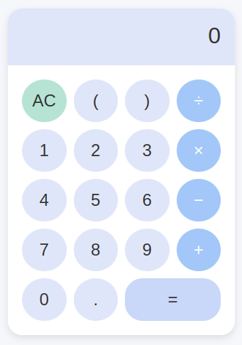

# Simple, "Right-Side-Up" 😉 Calculator

A simple, responsive calculator built using HTML, CSS, and JavaScript. This project replicates the UI design of a basic calculator with essential operations and is optimized for both mobile and desktop views—but puts the numbers in [the same order as on a telephone](https://ux.stackexchange.com/questions/16666/why-do-numpads-on-keyboards-and-phones-have-reversed-layouts), for those who prefer it.



## Features

- Basic arithmetic operations: addition, subtraction, multiplication, and division
- Responsive design for mobile and desktop screens
- Clear, minimalistic UI
- Light blue theme similar to standard calculator applications

## No Installation Required

Just [use it](https://codingthat.github.io/calculator/) on your phone's web browser.

## Technologies Used

- **HTML** for the structure
- **CSS** for styling and layout
- **JavaScript** for functional calculator operations

## Getting Started

Follow these steps to set up the project locally.

### Prerequisites

You’ll need a code editor like [Visual Studio Code](https://code.visualstudio.com/) and a browser.

### Installation

1. Clone the repository:

   ```bash
   git clone https://github.com/savagearun/calculator.git
   ```

2. Open the project folder:

   ```bash
   cd simple-calculator
   ```

3. Open `index.html` in your browser to see the calculator in action.

## Usage

- Click the numbers and operators to perform calculations.
- Use **AC** to clear the display.
- Supports basic operations: addition (+), subtraction (−), multiplication (×), and division (÷).
- The **equal (=)** button evaluates the current expression.

## Code Structure

- **HTML**: Contains the calculator layout with a display area and buttons.
- **CSS**: Styles the layout with a clean, rounded button design and responsive layout for different screen sizes.
- **JavaScript**: Adds interactivity to the calculator, allowing operations to be calculated and displayed.

## Contributing

Feel free to contribute to this project. Pull requests are welcome. For major changes, please open an issue first to discuss what you would like to change.

## License

This project is open-source and available under the [MIT License](LICENSE).


- **Original Author:** Arun Kumar ([GitHub Profile](https://github.com/savagearun))
- **This Fork's Contributors:** Kevin Bloch ([@codingthat](https://github.com/codingthat))